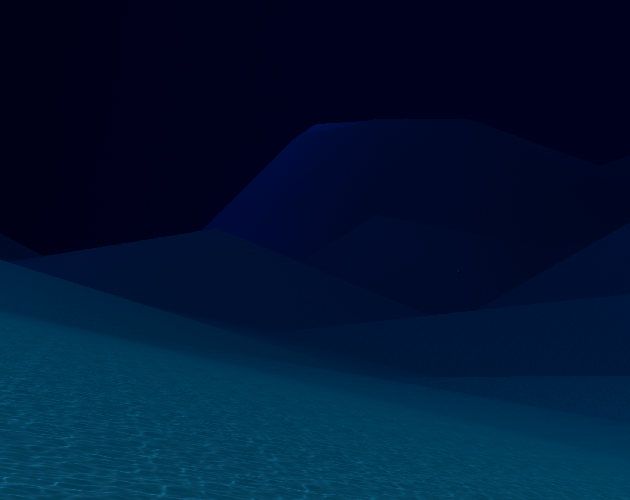

# SubScavenger

## **This game is a VERY early prototype that was made in less than a week.**

What's the goal of the game ? Collect the maximum of Cubes and Spheres you can (For now et least) 

Basic I know...

Yes the game is CLEARLY un-finished. 

Yes you do spawn sometimes in the rocks 

Yes some basic assets were used

But I didn't have enough time to polish the game :(

## Controls

- E to pickup, G to drop

- CTRL and Space to go up and down

- ZQSD for movement (games isn't localised yet... so yw AZERTY keyboards)

- Escape to pause the game (and leave this nightmare lmao)

## Future Plans?

-Actual Menus and Options

-Fix all of the bugs and things I didn't have time to add is step 1

-Add real assets ( made by hand / by an artist )

-Day/Night Cycle

-Terrain and object generation rework

-Change the Shark (that isn't scary) to actual monsters (like Leviathans)

-Multiplayer

## Steam release when game is 100% done ?

Yes 
I want this game to be a lively underwater world and not what it is now (the oposite lmao) with different biomes the further you go down, and monsters ready to get you at any point.
My original plan for this game was a horror game (which has failed lol) in an underwater setting (basically Lethal Company + Subnautica)

## If you want to try it for yourself, you can find it here :
https://harpie94.itch.io/subscavenger
